# Network Documentation

Based on *auto-generated from UniFi Controller configuration*

**.env**

```
CONTROLLER="http://<ip.addr>"
USERNAME="<username>"
PASSWORD="<password>"
```

**Script usage:**

Export Unify configuration, use [unify.sh](scripts/unifi.sh)

```
./unify.sh
```

Create Mermaid maps from configuration, use [unifi-to-mermaid.py](scripts/unifi-to-mermaid.py)

```
python3 unifi-to-mermaid.py
```

## Physical topology

```mermaid
graph LR
    Internet["🌐 Telia"]
    Gateway["Federation<br/>UDM SE"]
    Internet --> Gateway
    SW1["Yorktown<br/>Switch (10 ports)"]
    AP2 ---|"Port 1"| SW1
    AP2["DS7<br/>Access Point<br/>📶 Wireless Mesh"]
    AP3["DS9<br/>Access Point<br/>📶 Wireless Mesh"]
    AP1["DS3<br/>Access Point<br/>🔌 <br/>📶 Wireless Mesh"]
    AP3 -.-> |"Mesh"| AP2
    AP1 -.->|"Mesh"| AP2
    AP1 -.->|"Mesh"| AP3
    Gateway ---|"Port 1"| AP1
```



## Logical topology


## Port Mapping

Detailed port-by-port documentation for cable management.

### Federation (gateway/router)
*Model: UDMPROSE*

| Port | Status | Speed | Device Connected | Device Type | VLAN | Profile | PoE | Notes |
|------|--------|-------|------------------|-------------|------|---------|-----|-------|
| 1 | 🟢 Up | 1000M | DS3 | Access Point | Default | Default | Yes (8.9W) | Full Duplex |
| 2 | 🔴 Down | 10M | Not Connected |  | Default | Default | Yes (off) |  |
| 3 | 🟢 Up | 100M | LAN Device | Network | Default | Default | Yes (1.1W) | Full Duplex |
| 4 | 🔴 Down | 10M | Not Connected |  | Default | Default | Yes (auto) |  |
| 5 | 🟢 Up | 1000M | LAN Device | Network | Default | Default | Yes (off) | Full Duplex |
| 6 | 🟢 Up | 1000M | LAN Device | Network | Default | Default | Yes (off) | Full Duplex |
| 7 | 🔴 Down | 10M | Not Connected |  | Default | Default | Yes (off) |  |
| 8 | 🔴 Down | 10M | Not Connected |  | Default | Default | Yes (off) |  |
| 9 | 🟢 Up | 1000M | LAN Device | Network | Default | Default | No | Full Duplex |
| 10 | 🔴 Down | 10M | Not Connected |  | Default | Default | No |  |
| 11 | 🔴 Down | 10M | Not Connected |  | Default | Default | No | Named: SFP+ 2 |

**Summary:** 5/11 ports active
, 8 PoE ports (10.0W total)

### Yorktown (switch)
*Model: US8P150*

| Port | Status | Speed | Device Connected | Device Type | VLAN | Profile | PoE | Notes |
|------|--------|-------|------------------|-------------|------|---------|-----|-------|
| 1 | 🟢 Up | 1000M | Gateway/Router | Uplink | Default | Default | Yes (6.4W) | Full Duplex |
| 2 | 🟢 Up | 1000M | Unknown Device | Unknown | Default | Default | Yes (off) | Full Duplex |
| 3 | 🔴 Down | N/A | Not Connected |  | Default | Default | Yes (auto) |  |
| 4 | 🟢 Up | 1000M | Unknown Device | Unknown | Default | Default | Yes (off) | Full Duplex |
| 5 | 🟢 Up | 1000M | Unknown Device | Unknown | Default | Default | Yes (off) | Full Duplex |
| 6 | 🟢 Up | 1000M | Unknown Device | Unknown | Default | Default | Yes (off) | Full Duplex |
| 7 | 🔴 Down | N/A | Not Connected |  | Default | Default | Yes (off) |  |
| 8 | 🟢 Up | 1000M | Unknown Device | Unknown | Default | Default | Yes (off) | Full Duplex |
| 9 | 🔴 Down | N/A | Not Connected |  | Default | Default | No |  |
| 10 | 🔴 Down | N/A | Not Connected |  | Default | Default | No |  |

**Summary:** 6/10 ports active
, 8 PoE ports (6.4W total)

## Firewall zone configuration

*UDM SE uses zone-based firewall. Zone details not accessible via API.*

| VLAN | Network Name | Subnet | Internet Access | Firewall Zone |
|------|--------------|--------|-----------------|---------------|
| 20 | Secure | 192.168.20.1/24 | 🌐 Yes | 6825bf96... |
| 30 | Media | 192.168.30.1/24 | 🌐 Yes | 6825bfd8... |
| 50 | IoT | 192.168.50.1/24 | 🌐 Yes | 6825bfd0... |
| 60 | Services | 192.168.60.1/24 | 🌐 Yes | 6842f187... |
| 70 | Storage | 192.168.70.1/24 | 🚫 No | 6825bfe6... |
| 90 | Guest | 192.168.90.1/24 | 🌐 Yes | 6825be58... |
| WAN | Primary (WAN1) | N/A | 🌐 Yes | 6825be58... |
| WAN | Secondary (WAN2) | N/A | 🌐 Yes | 6825be58... |
| WAN | Management | 192.168.1.1/24 | 🌐 Yes | 6825be58... |
| WAN | WireGuard Server | 192.168.100.1/24 | 🌐 Yes | 6825be58... |

### Firewall Zone matrix